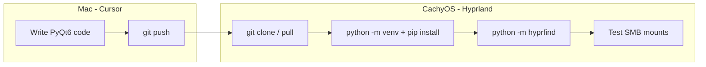
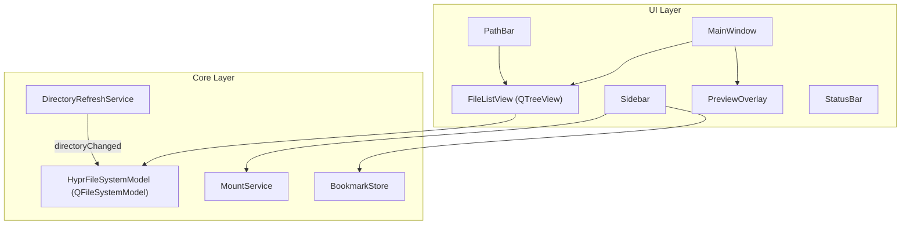

# HyprFind — Finder-quality file manager (PyQt6)

## Goal

Ship a **list-view-first** file browser that fixes the real pain points Dolphin misses on Hyprland/CachyOS:

- Reliable refresh on **SMB/CIFS and GVFS mounts** (not just local ext4)
- **Spacebar preview** for common file types
- **Keyboard navigation** that feels like Finder (type-ahead, Enter, Backspace, arrows)
- **Sidebar** with bookmarks + mounted volumes
- **Refresh button** that forces a real model reload
- Clean **dark theme** suited to Hyprland

Column view and two-pane modes are **post-MVP**; list view is the default and only view in v1.

---

## Development workflow (Mac Cursor → CachyOS)

You have two viable paths; both start with the same git-backed project scaffold.



**Recommended: develop on Mac, validate SMB on Cachy**

| Step | Mac | CachyOS |
|------|-----|---------|
| Scaffold | Create repo, PyQt6 app, dark QSS | — |
| Local UI iteration | Run against `~/`, verify layout/keys/preview | — |
| Network refresh | Unit-test polling logic with mocked listings | Clone repo, `pip install -e .`, run app |
| SMB truth test | — | Open `/run/user/$UID/gvfs/...` or `/mnt/smb/...`, add/delete files remotely, confirm auto-refresh |

**Cachy setup (one-time, documented in README):**

```bash
sudo pacman -S python python-pip python-pyqt6  # or venv + pip from pyproject.toml
git clone <repo> && cd hyprfind
python -m venv .venv && source .venv/bin/activate
pip install -e ".[dev]"
python -m hyprfind
```

**Alternative:** Copy this plan to Cursor on Cachy and build entirely there — same architecture, faster SMB feedback, slower Mac-side iteration.

PyQt6 runs on both platforms; only **mount detection + SMB polling** need Linux validation. UI, preview, bookmarks, and keyboard logic are fully developable on Mac.

---

## Architecture



### UI layout (Finder list view analogue)

```
┌──────────┬────────────────────────────────────────────────────┐
│ Sidebar  │  ◀ ▶  ↻   /home/kevin/Documents          [path bar] │
│          ├────────────────────────────────────────────────────┤
│ Favorites│  Name          Date Modified    Size      Kind     │
│  Home    │  report.pdf    Jun 7 2026       1.2 MB    PDF      │
│  Desktop │  notes.txt     Jun 6 2026       4 KB      Text     │
│  ...     │  ...                                               │
│          │                                                    │
│ Volumes  │                                                    │
│  /       │                                                    │
│  /mnt/…  │                                                    │
└──────────┴────────────────────────────────────────────────────┘
```

- **Left:** `QListWidget` or `QTreeWidget` with Favorites + Volumes sections
- **Top:** back/forward history, refresh button, editable path bar (Enter to navigate)
- **Center:** `QTreeView` bound to `QFileSystemModel` with columns: Name, Date Modified, Size, Type (hide dotfiles by default; toggle later)
- **Preview:** floating `QDialog` / frameless overlay on Space (dismiss on Space/Esc/click outside) — not a permanent right pane (keeps list view full-width like Finder Quick Look)

---

## Critical technical decision: refresh on SMB

`QFileSystemWatcher` uses **inotify** on Linux. It works for local filesystems but **does not reliably fire on CIFS/SMB, NFS, or many GVFS paths** — this is a kernel/protocol limitation, not a Qt bug.

**HyprFind's differentiator:** a `DirectoryRefreshService` that picks strategy per path:

```python
# Pseudocode — core/hyprfind/core/refresh.py
def strategy_for(path: str) -> Literal["inotify", "poll"]:
    mount = MountService.mount_for_path(path)
    if mount and mount.fstype in {"cifs", "smb3", "nfs", "fuse.gvfsfs", "fuse.gvfsd-fuse"}:
        return "poll"
    if path.startswith(f"/run/user/{uid}/gvfs/"):
        return "poll"
    return "inotify"
```

| Strategy | When | Mechanism |
|----------|------|-----------|
| **inotify** | Local ext4/btrfs/etc. | `QFileSystemWatcher.addPath(current_dir)` |
| **poll** | SMB, NFS, GVFS | `QTimer` every ~1.5s; compare directory snapshot (name + mtime + size hash); emit `changed` on diff |
| **manual** | User clicks ↻ | `model.refresh_directory(path)` — re-read listing, emit `dataChanged` / targeted invalidation |

On directory navigation, **stop old watch/poll, start new** for the opened folder only (not the whole tree — avoids inotify descriptor limits).

`MountService` reads [`/proc/mounts`](https://www.kernel.org/doc/Documentation/filesystems/proc.txt) (stdlib, no extra dep) and maps longest-prefix mount for any path. Also scan `~/.gvfs` / `/run/user/$UID/gvfs/` for GVFS SMB URLs.

---

## Keyboard navigation (Finder-like)

| Key | Action |
|-----|--------|
| ↑/↓ | Move selection |
| Enter | Open file (xdg-open) or enter folder |
| Backspace | Go to parent directory |
| Space | Toggle Quick Look preview for selection |
| Esc | Close preview |
| Cmd/Ctrl+L | Focus path bar |
| Cmd/Ctrl+R / F5 | Force refresh |
| Cmd/Ctrl+[ / ] | Back / forward in history |
| Type letters | Type-ahead select (built-in `QTreeView` incremental search with ~1s reset) |

Use `QShortcut` for app-level bindings; ensure `QTreeView` has focus after navigation.

---

## Spacebar preview (Quick Look)

MVP preview types:

| Type | Renderer |
|------|----------|
| Images (png, jpg, gif, webp, svg) | `QLabel` + scaled `QPixmap` |
| Text/code (txt, md, py, json, log, …) | `QPlainTextEdit` read-only, first ~512 KB |
| PDF | `QPdfView` (Qt6 Pdf module — add `PyQt6-Qt6` pdf bindings or `pypdf` text fallback) |
| Unsupported | Show icon + metadata (size, mtime, mime) |

Detect via `mimetypes` + extension fallback. Open files with `QDesktopServices.openUrl` / `xdg-open` on Enter.

---

## Project structure

```
hyprfind/
├── pyproject.toml          # deps: PyQt6; optional: PyQt6-WebEngine later
├── README.md               # install, run, CachyOS notes, Hyprland launch
├── hyprfind.desktop        # XDG desktop entry (Linux)
├── hyprfind/
│   ├── __init__.py
│   ├── __main__.py         # python -m hyprfind
│   ├── app.py              # QApplication, dark palette, load QSS
│   ├── core/
│   │   ├── model.py        # HyprFileSystemModel (refresh_directory)
│   │   ├── refresh.py      # DirectoryRefreshService (inotify + poll)
│   │   ├── mounts.py       # /proc/mounts parser
│   │   ├── bookmarks.py    # ~/.config/hyprfind/bookmarks.json
│   │   └── history.py      # back/forward stack
│   ├── ui/
│   │   ├── main_window.py
│   │   ├── sidebar.py
│   │   ├── file_list.py    # QTreeView wrapper
│   │   ├── path_bar.py
│   │   ├── preview.py      # Quick Look overlay
│   │   └── styles/
│   │       └── dark.qss
│   └── utils/
│       └── paths.py        # XDG dirs, tilde expand
└── tests/
    ├── test_mounts.py
    └── test_refresh_poll.py
```

---

## Implementation phases

### Phase 1 — Runnable shell (~day 1)

- `pyproject.toml` + `README.md` with Mac and Cachy install instructions
- `QApplication` with Fusion style + dark `QPalette` + [`hyprfind/ui/styles/dark.qss`](hyprfind/ui/styles/dark.qss)
- `MainWindow` with sidebar placeholder, toolbar (back/forward/refresh), path bar
- `QFileSystemModel` + `QTreeView` list showing home directory
- Launch via `python -m hyprfind`

### Phase 2 — Navigation + sidebar

- Sidebar favorites (Home, Desktop, Documents, Downloads via `xdg-user-dir` or `Path.home()` fallbacks)
- `MountService` populates Volumes section from `/proc/mounts`
- Path bar navigation + back/forward `HistoryStack`
- Enter opens files/folders; Backspace goes up
- Bookmarks persist to `~/.config/hyprfind/bookmarks.json`; context menu "Add to Favorites"

### Phase 3 — Refresh system (the killer feature)

- `DirectoryRefreshService` with inotify + poll strategies
- `HyprFileSystemModel.refresh_directory()` called on change signal and refresh button
- Status bar indicator: "Watching" vs "Polling (SMB)" so you know it's working
- Unit tests for mount detection and poll diff logic (mock `os.scandir`)

### Phase 4 — Preview + polish

- Spacebar Quick Look overlay
- Sortable columns (click header)
- `.desktop` file for Hyprland launcher
- Context menu: Open, Open With, Copy Path, Rename, Delete (using `QFileSystemModel` built-ins where possible)

### Post-MVP (explicitly deferred)

- Column view (`QColumnView` + custom column click handling)
- Two-pane mode
- Icon view
- Tabs, split view, trash integration, search

---

## Dependencies

```toml
# pyproject.toml (minimal)
dependencies = ["PyQt6>=6.6"]
optional = ["PyQt6-Pdf"]  # if available for PDF preview; else text fallback
```

No `psutil` required — `/proc/mounts` parsing is sufficient and keeps install light on Cachy.

---

## Risks and mitigations

| Risk | Mitigation |
|------|------------|
| SMB still stale if poll interval too slow | Default 1.5s; configurable in `~/.config/hyprfind/config.json` |
| GVFS paths vary by distro | Detect `/run/user/$UID/gvfs/` prefix + treat as poll |
| QFileSystemModel weak network refresh | Custom `refresh_directory()` bypasses model's internal cache |
| Mac dev can't test real SMB | Ship `tests/` + README Cachy test checklist; validate on Linux before calling SMB "done" |
| Wayland/Hyprland window decorations | Use standard Qt widgets; optional `hyprfind.desktop` with `Exec=python -m hyprfind` |

---

## Success criteria (MVP done when)

1. Open an SMB share on CachyOS; create a file from another machine → HyprFind list updates within ~2s **without** pressing refresh
2. Press ↻ → immediate reload even if watcher missed
3. Space on image/PDF/text shows preview; Esc dismisses
4. Arrow + type-ahead + Enter + Backspace feel natural in list view
5. Sidebar volumes include your SMB mount; favorites persist across restarts
